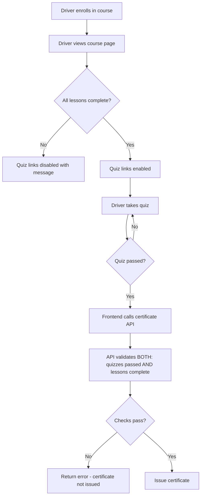

# Security Review: Course Completion Bypass Vulnerability

## Executive Summary

**Severity**: High  
**Status**: Confirmed - Real vulnerability exists  
**Impact**: Drivers can obtain certificates without completing any lessons

---

## Findings Confirmed

### 1. Certificate API - No Lesson Validation
**File**: [`src/app/api/certificates/route.js`](src/app/api/certificates/route.js:13-20)

The certificate issuance logic only verifies quiz completion:

```javascript
// Lines 13-20 - ONLY checks quiz passes, NOT lesson completion
const { data: quizzes } = await serviceClient.from('quizzes').select('id').eq('course_id', courseId);
// ...
const allPassed = quizzes.every((quiz) => attempts?.some((a) => a.quiz_id === quiz.id && a.passed));
if (!allPassed) return NextResponse.json({ message: 'Not all quizzes passed yet' });
```

**Missing**: No query to `lesson_progress` table to verify lessons are completed.

---

### 2. Course UI - Quiz Access Not Restricted
**File**: [`src/app/dashboard/courses/[courseId]/page.js`](src/app/dashboard/courses/[courseId]/page.js:131-152)

The quiz cards are rendered as clickable links with no disabled state:

```javascript
// Lines 135-138 - Quiz link always enabled
<Link
    key={quiz.id}
    href={`/dashboard/courses/${courseId}/quiz/${quiz.id}`}
    className={`... ${passed ? 'border-l-4 border-green-500' : ''}`}
>
```

**Missing**: No conditional logic to disable quiz access until all lessons are complete.

---

### 3. Quiz Submission - Auto-Certificate Trigger
**File**: [`src/app/dashboard/courses/[courseId]/quiz/[quizId]/page.js`](src/app/dashboard/courses/[courseId]/quiz/[quizId]/page.js:84-91)

When a quiz is passed, the frontend immediately calls the certificate API:

```javascript
// Lines 84-91 - No lesson completion check before certificate request
if (passed) {
    await fetch('/api/certificates', {
        method: 'POST',
        headers: { 'Content-Type': 'application/json' },
        body: JSON.stringify({ courseId }),
    });
}
```

**Issue**: This happens regardless of lesson completion status.

---

## Database Schema Reference

### lesson_progress Table ([`supabase/lms_schema.sql`](supabase/lms_schema.sql:80-88))

| Column | Type | Description |
|--------|------|-------------|
| `id` | UUID | Primary key |
| `user_id` | UUID | Reference to lms_users |
| `lesson_id` | UUID | Reference to lessons |
| `completed` | BOOLEAN | true/false |
| `completed_at` | TIMESTAMPTZ | When completed |

---

## Recommended Fixes

### Backend Fix: Validate Lesson Completion in Certificate API

**File**: `src/app/api/certificates/route.js`

**Changes Required**:
1. Add query to fetch all lessons for the course
2. Add query to check lesson_progress for the user
3. Verify all lessons have `completed: true` before issuing certificate
4. Return clear error message if lessons are incomplete

```javascript
// Add after line 15 (quiz check)
// 1. Get all lessons for the course
const { data: lessons } = await serviceClient.from('lessons').select('id').eq('course_id', courseId);
if (!lessons || lessons.length === 0) return NextResponse.json({ message: 'No lessons in course' });

// 2. Check lesson progress
const { data: progress } = await serviceClient.from('lesson_progress')
    .select('lesson_id, completed')
    .eq('user_id', user.id)
    .in('lesson_id', lessons.map((l) => l.id));

// 3. Verify all lessons completed
const allLessonsComplete = lessons.every((lesson) => 
    progress?.some((p) => p.lesson_id === lesson.id && p.completed)
);
if (!allLessonsComplete) return NextResponse.json({ 
    message: 'Complete all lessons before taking the final quiz' 
});
```

---

### Frontend Fix: Disable Quiz Access Until Lessons Complete

**File**: `src/app/dashboard/courses/[courseId]/page.js`

**Changes Required**:
1. Add state to track if all lessons are complete
2. Disable quiz link and show visual indicator when lessons incomplete
3. Add tooltip or message explaining requirement

```javascript
// Add helper function (around line 46)
const allLessonsComplete = lessons.length > 0 && 
    lessons.every((l) => isLessonComplete(l.id));

// Modify quiz card (around line 135)
// Show disabled state with lock icon if lessons not complete
{!allLessonsComplete ? (
    <div className="flex items-center justify-between gap-3 bg-gray-50 rounded-xl p-4 opacity-60">
        <div className="flex items-center gap-3">
            <Lock className="w-5 h-5 text-gray-400" />
            <p className="text-sm font-medium truncate">{quiz.title}</p>
        </div>
        <span className="text-xs text-gray-500">Complete lessons first</span>
    </div>
) : (
    <Link href={`/dashboard/courses/${courseId}/quiz/${quiz.id}`}>
        {/* existing quiz card content */}
    </Link>
)}
```

---

## Implementation Workflow



---

## Summary of Required Changes

| Component | File | Change Type |
|-----------|------|--------------|
| Backend API | `src/app/api/certificates/route.js` | Add lesson completion validation |
| Course Page | `src/app/dashboard/courses/[courseId]/page.js` | Disable quiz until lessons complete |
| Quiz Page | `src/app/dashboard/courses/[courseId]/quiz/[quizId]/page.js` | (Optional) Add pre-check before allowing quiz access |

---

## Risk Assessment

- **Without backend fix**: Drivers can bypass via API calls directly
- **Without frontend fix**: Drivers can still access quiz (but won't get certificate)

**Recommendation**: Implement BOTH frontend and backend fixes for defense in depth.
