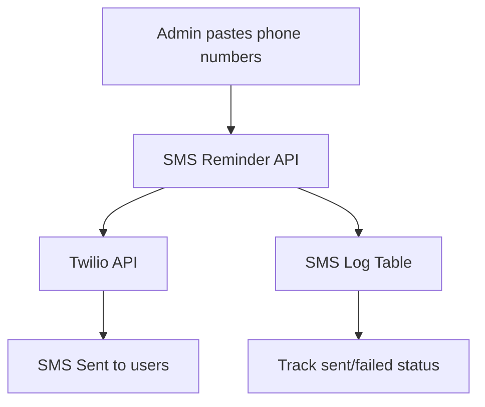

# SMS Reminder Strategy for 130 Incomplete Registrations

## Executive Summary
Convert 130 users who downloaded the app and verified their phone number via OTP but haven't completed full registration. Strategy: Admin pastes phone numbers → Send SMS via Twilio → Track delivery status in database.

## Current State Analysis
- **Database**: lms_users table - no phone field
- **Existing**: Email reminder system using Resend API
- **Gap**: No SMS capability

## Architecture



## Simplified Implementation Plan

### Phase 1: Infrastructure

1. **Install Twilio package**
   ```bash
   npm install twilio
   ```

2. **Environment variables** (.env.local)
   ```
   TWILIO_ACCOUNT_SID=your_account_sid
   TWILIO_AUTH_TOKEN=your_auth_token
   TWILIO_PHONE_NUMBER=+1234567890
   ```

3. **Create SMS log table**
   ```sql
   CREATE TABLE IF NOT EXISTS sms_log (
     id UUID PRIMARY KEY DEFAULT gen_random_uuid(),
     phone VARCHAR(20) NOT NULL,
     message TEXT NOT NULL,
     status TEXT DEFAULT 'pending' CHECK (status IN ('pending', 'sent', 'delivered', 'failed')),
     twilio_sid TEXT,
     error_message TEXT,
     sent_at TIMESTAMPTZ,
     created_at TIMESTAMPTZ DEFAULT NOW()
   );
   ```

### Phase 2: Backend

4. **Twilio client helper** (src/lib/twilio-client.js)
5. **SMS Reminder API** (src/app/api/sms/reminders/route.js)

### Phase 3: Admin Interface

6. **Admin SMS page** - Paste/type phone numbers, click Send
7. **View history** - See sent/failed status for each number

### Phase 4: Testing

8. **Test** - Send to your number first

## How It Works

1. Admin goes to SMS Reminders page
2. Pastes phone numbers (comma or newline separated)
3. Clicks "Send Reminder SMS"
4. System sends SMS to each number via Twilio
5. Each SMS result is logged with status (sent/failed)
6. Admin can see history and retry failed numbers

## Cost (Twilio Canada)
- ~$0.0079 CAD per SMS
- 130 users ≈ $1.03 CAD

## Next Steps
1. Set up Twilio account
2. Switch to Code mode to implement
